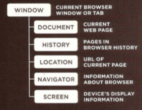
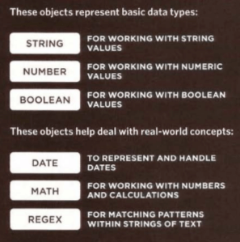
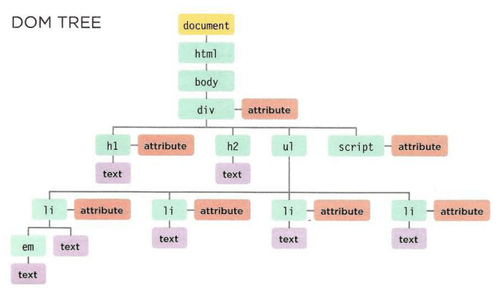
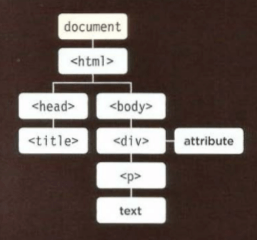
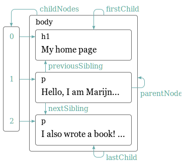
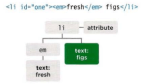
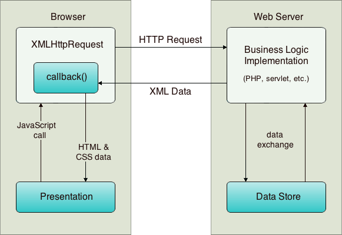
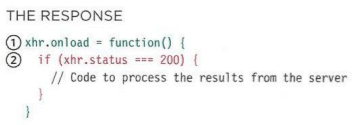
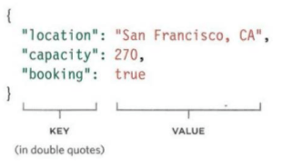

# JAVASCRIPT PARA WEB

---

## BUILT-IN OBJECTS

### Document Object Model

[Document Object Model](#dom)

### Browser Object Model

- El objeto superior es `window` que representa la ventana o pestaña del navegador.



- Propiedades

`window.innerHeight` - altura (excluding browser chrome/user interface) (px)  
`window.innerWidth` - anchura (excluding browser chrome/user interface) (px)  
`window.pageXOffset` - Distance document has been scrolled horizontally (px)  
`window.pageYOffset` - Distance document has been scrolled vertically (px)  
`window.screenX` - Coordenada X, respecto esquina superior-izquierda (px)  
`window.screenY` - Coordenada Y, respecto esquina superior-izquierda (px) `window.location` - URL actual (o ruta local al archivo)  
`window.document` - Referencia al objeto documento, usado para representar la pagina actual contenida en windows  
`window.history` - Referencia al objeto history de la pestaña o ventana del navegador que contiene detalles de las paginas que han sido vistas en esa ventana o pestaña  
`window.history.length` - numero de historias en el objeto history para esa pestaña o ventana del navegador  
`window.screen` - Hace referencia al objeto screen del monitor  
`window.screen.width` - Anchura de la pantalla del monitor(px)  
`window.screen.height` - Altura de la pantalla del monitor (px)

- Metodos

`window.a1ert()` - Crea una caja de dialogo con mensaje. El usuario debe pinchar OK para cerrarla  
`window.open()` - Abre una nueva ventana de navegador cuya URL es la especificada como parametro (no funciona si el navegador tiene bloqueado los pop-up)  
`window.print()` - Avisa al navegador que el usuario quiere escribir contenidos de la pagina actual (como si el usuario hubiera pulsado la opcion de imprimir del navegador)

### Global Javascript Objects

- Es un grupo de objetos individuales que cada uno hace referencia a una parte del lenguaje javascript



#### [String](../javascript/#string)

#### [Numero](../javascript/#numeros)

#### [Math](../javascript-apis/#math)

#### [Date](../javascript-apis/#date)

---

## DOM

> Hay 3 tecnicas de actualizar contenido HTML

> 1. `document.write()`
> 2. _`element`_`.innerHTML`
> 3. Manipulacion del DOM

### Arbol DOM

> El arbol DOM es una maqueta de una pagina web



-   
  En la parte superior del arbol esta un nodo documento que representa la pagina entera. Es el punto de arranque para todas las rutas por el arbol DOM.  
  Coincide con el `document object`

-   
  Los nodos elemento es lo que se busca en el arbol DOM antes de acceder a los nodes de atributo y texto  
  Para eso estan los metodos que permiten buscar y acceder a nodos elemento

-   
  Las etiquetas abiertas de los elementos HTML pueden contener atributos que estan representados por nodos atributos en al arbol DOM  
  No son hijos del elemento que los tiene, son parte de ese elemento, por eso hay metodos y propiedades especificas para leer y modificar esos atributos

-   
  Una vez accedido al nodo elemento puedes coger el texto dentro del elemento que esta contenido en su propio nodo texto  
  Pueden tener hijos pero seran hijos del elemento que los contiene

### Objeto document

> El objeto superior es `document` que representa la pagina como un todo

 

- Propiedades

`document.title` - Titulo del documento actual  
`document.lastModified` - Fecha de la ultima modificacion del documento actual  
`document.URL` - Devuelve una cadena con la URL del documento actual  
`document.domain` - Devuelve el dominio del documento actual

- Metodos

`document.write()` - Escribe texto al documento  
`document.getElementByld()` - Devuelve el elemento que coincide con el valor de id que se pasa  
`document.querySe1ectorA11()` - Devuelve lista de elementos que coincide con el selector CSS que se pasa como parametro  
`document.createElement()` - Crea un nuevo elemento  
`document.createTextNode()` - Crea un nuevo nodo de texto

### Acceder a elementos

- Seleccionar un elemento

`document.getElementById("name")` - Selecciona el elemento con id="name"  
`document.querySelector("h4")` - Selecciona el primer elemento h4  
_`element`_`.parentNode` - Toma el padre del elemento actual  
_`element`_`.previousSibling` - Coge el hermano previo  
_`element`_`.nextSibling` - Coge el hermano siguiente  
_`element`_`.firstChild` - Coge el primer hijo del actual elemento  
_`element`_`.lastChild` - Coge el ultimo hijo del actual elemento

```
¡ OJO ! En estos 5 ultimos con los WhiteSpace Nodes
```

- Seleccionar varios elementos : Los metodos devuelven una `NodeList`

`document.getElementsByClassName("name")` - Selecciona todos los elementos que tienen la clase="name"  
`document.getElementsByTagName("li")` - Coge todos los elementos que tienen el tag name="li"  
`document.querySelectorAll(h4)` - Selecciona todos los elementos que poseen h4

### Trabajar con elementos

#### Propiedades

_`element`_`.nodeValue` - Permite acceder al contenido de un nodo texto  
_`element`_`.innerHTML` - Permite acceder a elementos hijo y contenido de texto y de markup  
_`element`_`.textContent` - Permite acceder al texto del elemento y de sus hijos _`element`_`.className` - Valor del atributo class  
_`element`_`.id` - Valor del atributo id



- _`element`_`.nodeValue`  
  Una vez llegas de un elemento a su nodo texto, este tiene la propiedad nodeValue que te da acceso al valor del texto

```javascript
document.getElementById("one").firstChild.nextSibling.nodeValue;
```

- _`element`_`.textContent`  
  Permite acceder al texto del elemento y de sus hijos

```javascript
document.getElementByid("one").textContent;
```

- _`element`_`.innerText` **NO USAR**

- _`element`_`.innerHTML`

```javascript
var elContent = document.getElementByld('one').innerHTML;     // Get
// elContent =  "<em>fresh</em> figs"
document.getElementByld('one').innerHTML = elContent;         // Set
```

#### Manipulacion DOM

`document.createElement()` - Crea nodos  
`document.createTextNode()` - Crea nodos de texto  
_`element`_`.appendChild()` - Añade nodos  
_`element`_`.removeChild()` - Elimina nodo  
_`element`_`.hasAttribute(n)` - Chequea si existe el atributo n  
_`element`_`.getAttribute(n)` - Consigue el valor del atributo n  
_`element`_`.setAttribute(n)` - Pone el valor del atributo n  
_`element`_`.removeAttribute(n)` - Elimina el atributo n

> Crear nuevo contenido en la pagina

1. `document.createElement()` - Crea un nuevo nodo elemento y se guarda en una variable
2. `document.createTextNode()` - Crea un nuevo nodo texto y se guarda en una variable
3. _`element`_`.appendChild()` - Lo añade al arbol DOM como un hijo

```javascript
var newEl = document.createElement("li");
var newText document.createTextNode("quinoa");
newEl.appendChild(newText);
// Ahora lo posicionamos donde le corresponda
var position = document.getElementsByTagName("ul")[O];
position.appendChild(newEl);
```

> Eliminar contenido en la pagina

1. Almacenar el elemento a borrar en una variable
2. Almacenar el padre del elemento a borrar en una variable
3. Eliminar el elemento desde su elemento padre

```javascript
var removeEl = document.getElementsByTagName("li")[3];
var containerEl = removeEl.parentNode;
containerEl.removeChild(removeEl);
```

#### Style Objects

[Style Objects](http://www.w3schools.com/jsref/dom_obj_style.asp)  

`document.getElementById("myH1").style.color = "red";`

### NodeLists

> Son `collections`, parecen `arrays` y estan numerados como tal pero no lo son

- Propiedades

`length` - indica cuantos items hay en la NodeList

- Metodos

`item(n)` - devuelve el item con indice numero n  
`nodeLista[n]` - es mas comun esta sintaxis con corchetes

```javascript
var lista = document.getElementsByClassName("hot")
if (lista.length >= 1) {
  var primero = lista.item(0);
  var primero = lista[0];
}
```

- Iteraciones

```javascript
var lista = document.querySelectorAll("li.cold")
for (var i = 0; i < lista.lenth; i++) {
  lista[i].className = "hot";
}
```

### XSS Atacks

> **Escapar todo el contenido que generan los usuarios**  
> Todos los datos introducidos por usuarios deben escaparse en el servidor antes de ser mostrados en la pagina.

- HTML - Escapar todos estos caracteres para que se muestren como caracteres y no sean procesados como codigo


- Javascript -No incluir datos de fuentes sin confianza.Escapar todos los caracteres ASCII de valor menor a 256 que no sean caracteres alfanumericos

- URLs - Si tienes enlaces que datos que han introducido los usuarios usa el metodo `encodeURIComponent()` para codificar los siguientes caracteres :


> **Añadir contenido del usuario**

- Javascript:  

\- Usar `textContent` o `innerText`  
\- NO usar `innerHTML`

- jQuery:

\- Usar `.text()`  
\- NO Usar `.html()` salvo:

- No permitir al usuario contenido con markup
- Escapar todo el contenido del usuario y añadirlo como texto en lugar de como HTML

--------------------------------------------------------------------------------

## EVENTOS

> 1. Las Interacciones del usuario crean Eventos
> 2. Los Eventos disparan Codigo
> 3. El Codigo responde a los usuarios (p ej : modificando el DOM)

1. Seleccionar el elemento que queremos tenga un evento
2. Indicar que evento en ese elemento disparara la respuesta
3. Indicar el codigo a ejecutar cuando ocurra el evento

### Lista Eventos

- User Interface Events

`load` - La pagina web se ha terminado de cargar

```javascript
function setup() {         
  // Al haber cargado la pagina ya esta el contenido disponible 
}
window.addEventListener('load', setup, false);
```

`unload` - La pagina web se esta descargando a causa de haber pedido otra  
`beforeunload` - Justo antes de que el usuario abandone la pagina  
`error` - Navegador encuentra un error de Javascript  
`resize` - Navegador se ha redimensionado  
`scroll` - Usuario ha hecho scroll hacia arriba o abajo, puede referirse a la pagina entera o a un elemento especifico como por ejemplo textarea

- Keyboard Events

`keydown` - Pulsar una tecla(se repite mientras la tecla esta presionada)  
`keyup` - Soltar una tecla  
`keypress` - Mientras se inserta el caracter (se repite mientras la tecla esta presionada)

- Mouse Events

`click` - Pulsar y soltar un boton sobre el mismo elemento  
`dblclick` - Pulsar y soltar un boton dos veces sobre el mismo elemento  
`mousedown` - Pulsar un botón del ratón mientras esta sobre un elemento  
`mouseup` - Soltar un botón del ratón mientras esta sobre un elemento  
`mousemove` - Mover el raton  
`mouseover` - Mover el raton por encima de un elemento  
`mouseout` - Mover el raton fuera de un elemento

- Focus Events

`focus` , `focusin` - EL elemento gana el foco  
`blur` , `focusout` - EL elemento pierde el foco

- Form Events

`input` - Cambia el valor de cualquier `<input>`, `<textarea>` o elemento con el atributo `contenteditable`  
`change` - Cambia el valor en un `select box`, `checkbox` o `radio button`  
`submit` - Al enviar un formulario (usando un boton o una tecla)  
`reset` - Usuario pincha un boton de resetear formulario (Muy raro verlo)  
`cut` - Usuario corta contenido de un campo del formulario  
`copy` - Usuario copia contenido de un campo del formulario  
`paste` - Usuario pega contenido a un campo del formulario  
`select` - Usuario selecciona algo de texto en un campo de formulario

- Mutation Events : Ocurren cuando la estructura DOM cambia por un script

`DOMSubtreeModified` - Cambio affecta al documento  
`DOMNodeInserted` - Se ha insertado un nodo como hijo de otro nodo  
`DOMNodeRemoved` - Se ha eliminado un nodo desde otro nodo  
`DOMNodeInsertedIntoDocument` - Se ha insertado un nodo como descendiente de otro nodo  
`DOMNodeRemovedFromDocument` - Se ha eliminado un nodo como descendiente de otro nodo

- HTML5 Events

`DOMContentLoaded` - Salta cuando el arbol DOM (toda la estructura HTML) ya esta cargada) a diferencia de `load` que salta cuando todo el HTML y sus recursos (imagenes, iframes, scripts, css) se han cargado.  
Asi la pagina parece que es mas rapida de cargar. Se asigna al `document` o al `window`  
`hashchange` - Salta cuando hay cambios en la URL a partir del ancla #.  
Funciona sobre el objeto `window` y despues de saltar el objeto `event` tendra dos propiedades `oldURL`, `newURL`  
`beforeunload` - Salta en el objeto `windows` antes de tirar la pagina. Es el que usan para molestar diciendo si estas seguro de querer abandonar la pagina

### Manejadores Eventos

- HTML Event Handlers `NO USAR`

```html
<form method="post" action="http://www.example.org/register">
  <label for="username">Create a username: </label>
  <input type="text" id="username" onblur="checkUsername()" />
  <div id="feedback"></div>
  <label for="password">Create a password: </label>
  <input type="password" id="password" />
  <input type="submit" value="sign up!" />
</form>
```

```javascript
function checkUsername() {                             
  var elMsg = document.getElementById('feedback');     
  var elUsername = document.getElementById('username');
  if (elUsername.value.length < 5) {                   
    elMsg.textContent = 'Username must be 5 characters or more';
  } else {                                               
    elMsg.textContent = '';                             
  }
}
```

- Traditional DOM Event Handlers  
  La pega es que solo puedes vincular una funcion a un evento  
  _`element`**`.on`**`event`_`=`_`functionName`_;

```javascript
function checkUsername() {                             
  // codigo que sea
}
var el = document.getElementByld("username") ;
el.onblur = checkUsername;
```

- Event Listeners (DOM level 2 ) `USAR`  
  Permite que un solo evento dispare varios scripts

### Event Listener

- **Concepto**


- **Ejemplo**

```javascript
function checkUsername() {                             
  // codigo que sea
}
var el = document.getElementByld("username") ;
el.addEventListener("blur", checkUsername, false);
```

- **Usando Parametros**


```javascript
var elUsername = document.getElementById('username');   
var elMsg      = document.getElementById('feedback');   

function checkUsername(minLength) {                     
  if (elUsername.value.length < minLength) {            
    elMsg.innerHTML = 'Username must be ' + minLength + ' chars or more';
  } else {                                             
    elMsg.innerHTML = '';                              
  }
}

elUsername.addEventListener('blur', function() {        
  checkUsername(5);                                     
}, false);
```

```javascript
var button = document.querySelector("button");
button.addEventListener("mousedown", function(event) {
  if (event.which == 1)
    console.log("Left button");
  else if (event.which == 2)
    console.log("Middle button");
  else if (event.which == 3)
    console.log("Right button");
});
```

### Event FLow

> Describe el orden en el que los eventos se procesan  
> `Propagacion` : Los eventos registrados en nodos con hijos reciben algunos eventos que ocurren en los hijos. Si pulsamos un buton dentro de un parrafo los manejadores de evento del parrafo tambien recibiran el evento click. Si los dos tienen el evento el manejador mas especifico (el mas interno) va primero

- `bubbling` - el evento se captura y maneja primero por el elemento mas interno y despues de propaga hacua los elementos exteriores

- `Capturing` - el evento se captura primero por el elemento mas externo y se propaga hacia los elementos internos


### Objeto Event

- Propiedades

`target` - Objetivo del evento  
`type` - Tipo de evento que se ha disparado  
`cancelable` - Si se puede cancelar el comportamiento predeterminado de un elemento  
`screenX` , `screenY` - Coordenada de la posicion del cursor respecto del monitor  
`pageX` , `pageY` - Coordenada de la posicion del cursor respecto de la pagina  
`clientX` , `clientY` - Coordenada de la posicion del cursor respecto del navegador

- Metodos

`preventDefault()` - Cancela el comportamiento por defecto del evento (si es posible)  
`stopPropagation()` - Detiene la propagacion del evento por bubbling o capturing

- Event listener sin parametros

La referencia al objeto event se pasa automaticamente aunque en la funcion debe nombrarse (lo normal es `e` para `event`)

```javascript
function checkUsername(e) {
  var target = e.target;
}
var el = document.getElementById("username");
el.addEventListener("blur", checkUsername, false);
```

- Event listener con parametros

La referencia al objeto event se pasa automaticamente pero debe nombrarse en los parametros

```javascript
function checkUsername(e, min) {
  var target = e.target;
}
var el = document.getElementById("username");
el.addEventListener("blur", function(e) {
  checkUsername(e, 5);
}, false);
```

### Delegacion

Para evitar malos rendimientos por ejemplo en listas o celdas o tablas se pone el `event listener` en el elemento que los contiene y luego se usa la propiedad `target` del objeto `event` para encontrar al hijo que desato el evento

### Setting Timers

`setTimeout`: similar a `requestAnimationFrame`, fija una funcion para ser ejecutada mas tarde, pero en lugar de llamarla en el siguiente redibujado espera un numero de milisegundos

```javascript
document.body.style.background = "blue";
setTimeout(function() {
  document.body.style.background = "yellow";
}, 2000);
```

`clearTimeout` cancela la ejecucion de la funcion planeada

```javascript
var bombTimer = setTimeout(function() {
  console.log("BOOM!");
}, 500);

if (Math.random() < 0.5) { // 50% chance
  console.log("Defused.");
  clearTimeout(bombTimer);
}
```

`setInterval` y `clearInterval` son para lo mismo pero la ejecucion se repite cada X milisegundos

```javascript
var ticks = 0;
var clock = setInterval(function() {
  console.log("tick", ticks++);
  if (ticks == 10) {
    clearInterval(clock);
    console.log("stop.");
  }
}, 200);
```

### Debouncing

Hay eventos que se pueden disparar muy muy rapidamente (como `mousemove` o `scroll` pej). Hay que tener cuidado de no consumir mucho tiempo en su manejador o la pagina se lageara.

Se puede usar setTimeout para suavizar el evento y que no haya lageos

```javascript
// Aqui se responde a mousemove pero una vez cada 250 milisegundos
function displayCoords(event) {
  document.body.textContent = "Mouse " + event.pageX + ", " + event.pageY;
}
var scheduled = false, lastEvent;
addEventListener("mousemove", function(event) {
  lastEvent = event;
  if (!scheduled) {
    scheduled = true;
    setTimeout(function() {
      scheduled = false;
      displayCoords(lastEvent);
    }, 250);
  }
});
```

---

## AJAX

### Conceptos

> Ajax permite pedir datos al servidor y cargarlos sin tener que refrescar la pagina entera  
> Los servidores usan para enviar los datos HTML, XML o JSON  
> Ajax usa un modelo asicrono, permite hacer cosas mientras el navegador espera los datos del servidor para cargarlos

> 

> 1. Peticion: El navegador pide datos al servidor, la peticion puede incluir datos que el servidor necesite al igual que un formulario puede enviar datos a un servidor

> 2. En el servidor ocurre lo que sea y se genera una respuesta que puede ser en forma de HTML u otro formato como XML o JSON que luego el navegador convertira en HTML

> 3. Respuesta: cuando el navegador recibe la respuesta del servidor dispara un evento el cual puede ser usado para ejecutar una funcion javascipt que procesara los datos y los mostrara en pantalla

### XMLHttpRequest Object

> Los navegadores usan el objeto `XMLHttpRequest` para manejar peticiones Ajax. Cuando el servidor responde a la peticion del navegador el mismo objeto `XMLHttpRequest` procesa el resultado

- **Peticiones**

> 

> 1. Se instancia el objeto `XMLHttpRequest` para crear un nuevo objeto `xhr`
> 2. `.open()` - Metodo HTTP , url que manejara la peticion, true|false si es asincrono
> 3. `.send()` - Envia la peticion al servidor, se puede pasar informacion extra o no

- **Respuestas**

> 

> 1. Cuando el navegador recibe y carga la respuesta del servidor se dispara el evento `onload`. Esto provoca que se ejecute una funcion
> 2. La funcion chequea la propiedad `status` del objeto para asegurarse de que la respuesta del servidor esta bien

### Formatos de datos

```html
<!DOCTYPE html>
<html>
  <head>
    <meta charset="UTF-8">
    <title>JavaScript AJAX - Loading HTML, JSON y XML</title>
  </head>
  <body>
    <header><h1>THE MAKER BUS</h1></header>
    <h2>The bus stops here.</h2>
    <section id="content"></section>
    <script src="js/data.js"></script>

  </body>
</html>
```

```html
// data.html
<div class="event">
  
  <p><b>Los Angeles, CA</b>  
  May 1</p>
</div>
<div class="event">
  
  <p><b>Austin, TX</b>  
  May 15</p>
</div>
<div class="event">
  
  <p><b>New York, NY</b>  
  May 30</p>
</div>
```

```json
// data.json
{
  "events": [
    {
      "location": "San Francisco, CA",
      "date": "May 1",
      "map": "img/map-ca.png"
    },
    {
      "location": "Austin, TX",
      "date": "May 15",
      "map": "img/map-tx.png"
    },
    {
      "location": "New York, NY",
      "date": "May 30",
      "map": "img/map-ny.png"
    }
  ]
}
```

```xml
// data.xml
<?xml version="1.0" encoding="utf-8" ?>
<events>
  <event>
    <location>San Francisco, CA</location>
    <date>May 1</date>
    <map>img/map-ca.png</map>
  </event>
  <event>
    <location>Austin, TX</location>
    <date>May 15</date>
    <map>img/map-tx.png</map>
  </event>
  <event>
    <location>New York, NY</location>
    <date>May 30</date>
    <map>img/map-ny.png</map>
  </event>
</events>
```

- **[HTML](//brusbilis.com/chuletas/frontend/html5/)**

```javascript
var xhr = new XMLHttpRequest();       // Create XMLHttpRequest object

xhr.onload = function() {             // When response has loaded
  if(xhr.status === 200) {            // If server status was ok update
    var response = xhr.responsetext;  
    document.getElementById('content').innerHTML = response;
  }
};

xhr.open('GET', 'data/data.html', true);        // Prepare the request
xhr.send(null);
```

- **[JSON](#json)**

```javascript
var xhr = new XMLHttpRequest();         // Create XMLHttpRequest object

xhr.onload = function() {               // When readystate changes
  if(xhr.status === 200) {              // If server status was ok
    responseObject = JSON.parse(xhr.responseText);

    // BUILD UP STRING WITH NEW CONTENT (could also use DOM manipulation)
    var newContent = '';
    // Loop through object
    for (var i = 0; i < responseObject.events.length; i++) {
      newContent += '<div class="event">';
      newContent += '';
      newContent += '<p><b>' + responseObject.events[i].location +
                                                        '</b>  ';
      newContent += responseObject.events[i].date + '</p>';
      newContent += '</div>';
    }

    // Update the page with the new content
    document.getElementById('content').innerHTML = newContent;

  //}
};

xhr.open('GET', 'data/data.json', true);        // Prepare the request
xhr.send(null);
```

- **[XML](#xml)**

```javascript
var xhr = new XMLHttpRequest();          // Create XMLHttpRequest object

xhr.onload = function() {                // When response has loaded
  if (xhr.status === 200) {              // If server status was ok
    var response = xhr.responseXML;      // Get XML from the server
    // Find <event> elements and loop through them
    var events = response.getElementsByTagName('event');
    for (var i = 0; i < events.length; i++) {            
      var container, image, location, city, newline;     
      container = document.createElement('div');          
      container.className = 'event';                     
      // Add map image
      image = document.createElement('img');              
      image.setAttribute('src', getNodeValue(events[i], 'map'));
      image.setAttribute('alt', getNodeValue(events[i], 'location'));
      container.appendChild(image);
      // Add location data
      location = document.createElement('p');             
      city = document.createElement('b');
      newline = document.createElement('br');
      city.appendChild(document.createTextNode(getNodeValue(
                                            events[i], 'location')));
      location.appendChild(newline);
      location.insertBefore(city, newline);
      location.appendChild(document.createTextNode(getNodeValue(
                                            events[i], 'date')));
      container.appendChild(location);

      document.getElementById('content').appendChild(container);
    }
  }
}
  // Gets content from XML
  function getNodeValue(obj, tag) {                   
    return obj.getElementsByTagName(tag)[0].firstChild.nodeValue;
  }
};

xhr.open('GET', 'data/data.xml', true);             // Prepare the request
xhr.send(null);
```

### Datos de otros servidores

> Por seguridad AJAX no carga respùestas de otros dominios (conocidas como `cross-domain requests`)  
> Alternativas

> 1. `Proxy` - Crear un archivo en mi servidor que recoge los datos del servidor remoto. Asi las demas paginas de mi web pueden pedir los datos de ese archivo que actua de proxy
> 2. `JSONP`
> 3. `Cross-Origin resources Sharing CORS` - Añadir informacion extra a las cabeceras HTTP - [Buena Guia para CORS](http://www.html5rocks.com/en/tutorials/cors/?redirect_from_locale=es)

* **JSONP**

```html
// data-jsonp.html
<!DOCTYPE html>
<html>
<head>
  <meta charset="UTF-8">
  <title>JavaScript Ajax - JSONP</title>
</head>
<body>
  <header><h1>THE MAKER BUS</h1></header>
  <h2>The bus stops here</h2>
  <section id="content"></section>
  <script src="js/data-jsonp.js"></script>
  <script
    src="http://htmlandcssbook.com/js/jsonp.js?callback=showEvents">
  </script>
</body>
</html>
```

```javascript
// js/data-jsonp.js
function showEvents(data) {           // Callback when JSON loads
  var newContent = '';                // Variable to hold HTML
  // BUILD UP STRING WITH NEW CONTENT (could also use DOM manipulation)
  for (var i = 0; i < data.events.length; i++) {    // Loop through object
    newContent += '<div class="event">';
    newContent += '';
    newContent += '<p><b>' + data.events[i].location + '</b>  ';
    newContent += data.events[i].date + '</p>';
    newContent += '</div>';
  }
  // Update the page with the new content
  document.getElementById('content').innerHTML = newContent;
}
```

```javascript
// data/data-jsonp.js
showEvents({
  "events": [
    {
      "location": "San Francisco, CA",
      "date": "May 1",
      "map": "img/map-ca.png"
    },
    {
      "location": "Austin, TX",
      "date": "May 15",
      "map": "img/map-tx.png"
    },
    {
      "location": "New York, NY",
      "date": "May 30",
      "map": "img/map-ny.png"
    }
  ]
});
```

---

## JSON

### Notacion JSON

JSON es solo texto plano que envias por internet y luego el navegador convierte en objetos para usarlos

> 

> - KEYS colocados entre comillas (no comillas simples y separados del valor por dos puntos.

> - VALUES alguno de los siguientes tipos de datos

>   - `string` - Texto escrito entre comillas
>   - `number` - Numero
>   - `boolean` - `true` o `false`
>   - `array` - array de valores o de objetos
>   - `object` - objeto javascript que puede contener objetos hijos o arrays
>   - `null` - cuando el valor esta vacio o perdido

> - Cada pareja clave/valor esta separada por una coma excepto la ultima

### Objeto JSON

> events es un array que contiene dos objetos (uno por evento)

```json
{
  "events" : [
    {
      "location": "San Francisco, CA",
      "date": "May l",
      "map": "img/map-ca.png "
    },
    {    
      "location" : "Austin, TX",
      "date" : "May 15",
      "map": "img/map-tx.png"
    }
  ]
}
```

`JSON.stringify()` convierte objetos javascript en una cadena formateada usando JSON. Esto permite enviar objetos javascript de el navegador a otra aplicacion

`JSON.parse()` convierte una cadena de datos JSON en objetos javascript que el navegador pueda usar

---

## XML

Parecido a HTML pero las etiquetas describen el tipo de dato que hay dentro  
Se puede procesar XML usando los mismos metodos DOM de HTML, por eso es mas facil usando jQuery

```xml
<?xml version="1.O" encoding="utf-8" ?>
<events>
  <event>
  <location>San Francisco, CA</location>
  <date>May 1 </date>
  <map>img/map-ca.png</map>
  </event>
  <event>
  <location>Austin, TX</location>
  <date>May 15</ date>
  <map>img/map-tx.png</map>
  </event>
</events>
```

---

## FORMULARIOS

### Helper functions

- Añadir un `event listener`

```javascript
function addEvent (el, event, callback) {
  if ('addEventListener' in el) {                  
    el.addEventListener(event, callback, false);   
  } else {                                         
    el['e' + event + callback] = callback;         
    el[event + callback] = function () {
      el['e' + event + callback](window.event);
    };
    el.attachEvent('on' + event, el[event + callback]);
  }
}
```

- Borrar un `event listener`

```javascript  
function removeEvent(el, event, callback) {
  if ('removeEventListener' in el) {                       
    el.removeEventListener(event, callback, false);        
  } else {                                                
    el.detachEvent('on' + event, el[event + callback]);   
    el[event + callback] = null;  
    el['e' + event + callback] = null;  
  }  
}  
```

### Elemento Form

El `document` tiene una coleccion de formularios que guarda referencias a cada formulario de la pagina

> - `document.forms[1]` accede al segundo formulario de la pagina
> - `document.forms.login` accede al formulario cuyo atributo name="login"

Cada elemento `<form>` de la pagina tiene tambien una coleccion de elementos que tiene todos los controles del formulario dentro

> - `document.forms[1].element[0]` accede al primer control del segundo formulario de la pagina
> - `documento.forms[1].elements.password` accede al elemento del segundo formulario cuyo atributo name="password"

- **Propiedades**

`action` - La URL a que el formulario es enviado para ser procesado  
`method` - si se envia por GET o POST  
`name` - se usa poco, lo mas comun es seleccionar un formulario por su atributo id  
`elements` - una coleccion de elementos en el formulario con los que el usuario puede interactuar. Se puede acceder a ellos por los indices o por los valores de sus atributos ´name´

- **Metodos**

`submit()` - Tiene el mismo efecto que pinchar el boton submit  
`reset()` - Resetea el formulario a los valores iniciales como si la pagina se hubiera recargado

- **Eventos**

`submit` - Se dispara cuando el formulario es enviado  
`reset` - Se dispara cuando se resetea el formulario

### Controles del formulario

- **Propiedades**

`value` - En una entrada de texto es el texto que el usuario introduce, es el valor del atributo `value`  
`type` - Cuando un formulario se crea usando el elemento `<input>` esto define el tipo del elemento (text, radio, checkbox, password ..)  
`name` - Devuelve o establece el valor de atributo `name`  
`defaultValue` - Es el valor inicial de una entrada de texto cuando la pagina se renderiza  
`form` - El formulario al que el control pertenece  
`disabled` - Inhabilita el elemento del formulario  
`checked` - Indica que checkboxes o botones de radio han sido chequeados. Es un booleano que indica true si esta chequeado  
`defaultChecked` - El valor inicial de un checkbox o radio button (booleano)  
`selected` - Indica que un elemento de una select box esta seleccionado. Es un booleano que indica true si esta seleccionado.

- **Metodos**

`focus()` - Le da el foco a un elemento  
`blur()` - Le quita el fofo al elemento  
`select()` - Selecciona e ilumina el contenido de texto de un elemento de entrada de texto  
`click()` - Dispara un

> - evento `click` en botones, checkboxes y carga de archivos.
> - evento `submit` en el boton submit
> - evento `reset` en el boton reset

- **Eventos**

`blur` - Salta cuando el usuario sale de un campo  
`focus` - Salta cuando el usuario entra en un campo  
`click` - Salta cuando el usuario pincha un elemento  
`change` - Salta cuando el valor de un elemento cambia  
`input` - Salta cuando cambia el valor de los elementos `<input>` ó `<textarea>`  
`keydown`, `keyup`, `keypress` - Salta cuando se interactua con el teclado

---
